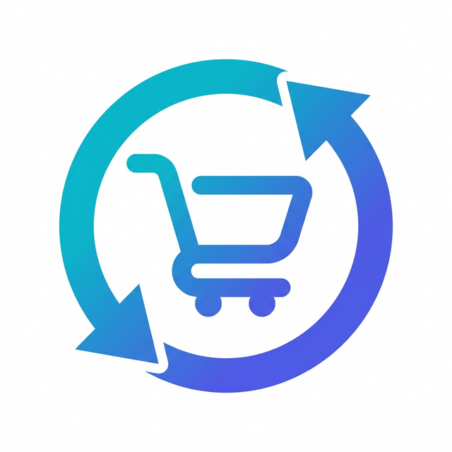
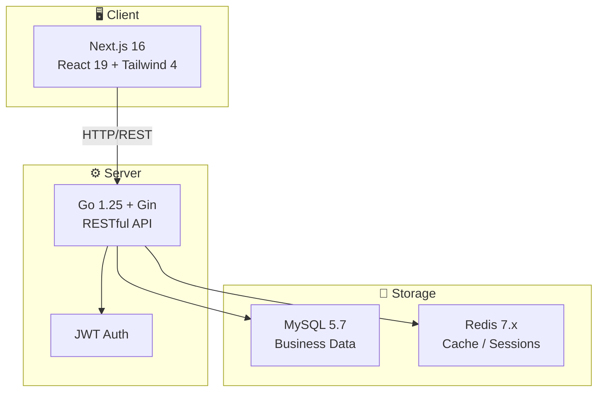

<div align="center">
  
  <h1>Turno</h1>
  <p><strong>🛒 A Modern Second-Hand Marketplace — Full-Stack Web + API Monorepo</strong></p>
  <p>End-to-end transaction flow: Sign up → List → Favorite → Order → Ship → Confirm → Review → After-sales</p>

  [](LICENSE)
  [](CONTRIBUTING.md)
  [](https://nodejs.org/)
  [](https://go.dev/)
  [](https://nextjs.org/)
  [](https://www.mysql.com/)

  [简体中文](./README.md) · [Quick Start](#-quick-start) · [Docs](./docs/) · [Contributing](./CONTRIBUTING.en.md)
</div>

---

## ✨ Features

- 🏠 **Configurable Homepage** — Admin-managed Hero / Banner / Featured product slots
- 📦 **Complete Transaction Flow** — List, publish, order, ship, confirm receipt, cancel
- ⭐ **Social Interactions** — Favorites, reviews, real-time chat, notification center
- 🔄 **After-Sales Workflow** — Buyer request → Seller response → Platform intervention, full timeline
- 🛡️ **Admin Console** — Trend dashboard, product moderation, user management, after-sales tickets, audit logs, CSV export
- 🔔 **Notification Engine** — Template library + action bindings + campaign sender
- 🌐 **Internationalization** — Chinese & English i18n with user language preference

## 📸 Screenshots

> The following are actual screenshots of the running application. See [docs/screenshots](./docs/screenshots/) for more.

<!-- TODO: Replace with real UI screenshots -->

| Home | Product Detail | Admin Dashboard |
|:----:|:--------------:|:---------------:|
|  |  |  |

## 🏗️ Architecture



### Tech Stack

| Layer | Technologies |
|-------|-------------|
| **Web Client** | Next.js 16 · React 19 · Tailwind CSS 4 · TypeScript |
| **API Server** | Go 1.25 · Gin · GORM · JWT |
| **Data Storage** | MySQL 5.7 · Redis 7.x |
| **Engineering** | npm Workspaces (Monorepo) · ESLint · Go Test |

## 🚀 Quick Start

### Requirements

| Dependency | Version |
|-----------|---------|
| Node.js | `>= 24.0.0` |
| Go | `>= 1.25.0` |
| MySQL | `5.7` |
| Redis | `7.x` |

### Setup

**1. Clone & install frontend dependencies**

```bash
git clone https://github.com/your-username/Turno.git
cd Turno
npm install
```

**2. Initialize the database**

```bash
mysql -u root -p < ./infra/sql/init.sql
```

> Creates the `turno` database with seed data.

**3. Configure the API**

```bash
cd services/api
cp configs/config.yaml.example configs/config.yaml
# Edit config.yaml to match your local MySQL / Redis settings
```

<details>
<summary>📋 Default configuration reference</summary>

| Setting | Default |
|---------|---------|
| MySQL host | `127.0.0.1:3306` |
| Database | `turno` |
| Username | `root` |
| Password | `123456` |
| Redis host | `127.0.0.1:6379` |
| API port | `8080` |

</details>

**4. Start the API**

```bash
cd services/api
go run ./cmd/api
```

Health check: `http://localhost:8080/api/v1/health`

**5. Start the Web app (new terminal)**

```bash
cd Turno
npm run dev:web
```

Visit `http://localhost:3000` 🎉

### Verification

```bash
# API tests
cd services/api && go test ./...

# Web lint & build
cd Turno
npm run lint:web
npm run build:web
```

## 📁 Project Structure

```
Turno/
├── apps/
│   └── web/                 # Next.js web client & admin console
├── services/
│   └── api/                 # Go API service
│       ├── cmd/api/         # Entry point
│       ├── internal/        # Business logic
│       ├── configs/         # Configuration files
│       └── public/          # Static assets
├── infra/
│   └── sql/                 # Database init & seed data
├── docs/                    # Project documentation
│   ├── api/                 # API documentation
│   ├── architecture/        # Architecture design
│   └── db/                  # Database design
├── packages/                # Shared packages (reserved)
├── CONTRIBUTING.md           # Contribution guide
├── CHANGELOG.md              # Change log
└── LICENSE                   # MIT License
```

## 🗺️ Roadmap

### v0.1 — MVP Transaction Loop ✅

- [x] User registration / login / JWT auth
- [x] Product CRUD & status management
- [x] Favorites, orders (create / ship / confirm / cancel)
- [x] Review system, real-time chat
- [x] Notification center & after-sales ticket workflow
- [x] Admin console (dashboard / moderation / user management / export / audit logs)
- [x] Homepage operations & notification template engine
- [x] Web ↔ API integration

### v0.2 — Experience Improvements 🚧

- [ ] Image upload & complete product image workflow
- [ ] Page-level RBAC & risk rule refinement
- [ ] Deeper integration tests & E2E tests
- [ ] Docker Compose deployment

### v0.3 — Auction Features 📋

- [ ] Core bidding / auction mechanism design
- [ ] Bid placement, countdown, auction settlement
- [ ] Auction-specific pages & notifications

## 📖 Documentation

| Document | Description |
|----------|-------------|
| [MVP Plan](./docs/architecture/mvp-plan.md) | Product planning & milestones |
| [Database Design](./docs/db/schema-v1.md) | Table structure & field descriptions |
| [API Documentation](./docs/api/phase1-api.md) | Endpoint list & request examples |
| [Project Structure](./Turno-项目结构设计.md) | Monorepo organization & directory guide |
| [Market Research](./Turno-竞品调研与产品开发说明书.md) | Competitive analysis & product positioning |
| [AI Development Notes](./docs/ai-development.md) | AI-assisted development workflow & tools |
| [Progress Tracking](./docs/progress.md) | Module completion tracking |

## 🤝 Contributing

We welcome all forms of contributions — bug reports, feature requests, and pull requests.

1. Fork this repository
2. Create a feature branch (`git checkout -b feat/amazing-feature`)
3. Commit your changes (`git commit -m 'feat: add amazing feature'`)
4. Push to the branch (`git push origin feat/amazing-feature`)
5. Open a Pull Request

See the [Contributing Guide](./CONTRIBUTING.en.md) for details.

## 📄 License

This project is open-sourced under the [MIT License](./LICENSE).
