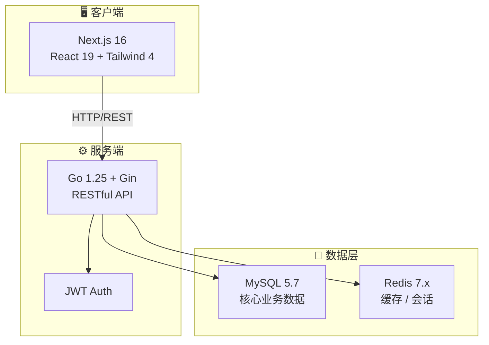

<div align="center">
  
  <h1>Turno</h1>
  <p><strong>🛒 现代化二手交易全栈平台 — Web + API Monorepo</strong></p>
  <p>打通"注册 → 发布 → 收藏 → 下单 → 发货 → 确认收货 → 评价 → 售后"完整链路的练手级全栈项目</p>

  [](LICENSE)
  [](CONTRIBUTING.md)
  [](https://nodejs.org/)
  [](https://go.dev/)
  [](https://nextjs.org/)
  [](https://www.mysql.com/)

  [English](./README.en.md) · [快速开始](#-快速开始) · [项目文档](./docs/) · [贡献指南](./CONTRIBUTING.md)
</div>

---

## ✨ 功能亮点

- 🏠 **可配置首页** — 后台运营 Hero / Banner / 精选商品推荐位
- 📦 **完整交易流程** — 商品发布、上架、下单、发货、确认收货、取消
- ⭐ **社交互动** — 收藏、评价、实时聊天、通知中心
- 🔄 **售后流转** — 买家申请 → 卖家响应 → 平台介入，完整工单时间线
- 🛡️ **管理后台** — 趋势看板、商品审核、用户管理、售后工单、审计日志、CSV 导出
- 🔔 **通知引擎** — 模板库 + 动作联动 + 运营推送面板
- 🌐 **国际化** — 中英双语 i18n，用户可切换语言偏好

## 📸 项目预览

> 以下为实际运行截图。更多页面详见 [docs/screenshots](./docs/screenshots/)。

<!-- TODO: 替换为真实 UI 截图 -->

| 首页 | 商品详情 | 管理后台 |
|:----:|:--------:|:--------:|
|  |  |  |

## 🏗️ 架构概览



### 技术栈

| 层级 | 技术选型 |
|------|----------|
| **Web 用户端** | Next.js 16 · React 19 · Tailwind CSS 4 · TypeScript |
| **API 服务端** | Go 1.25 · Gin · GORM · JWT |
| **数据存储** | MySQL 5.7 · Redis 7.x |
| **工程化** | npm Workspaces (Monorepo) · ESLint · Go Test |

## 🚀 快速开始

### 环境要求

| 依赖 | 版本要求 |
|------|----------|
| Node.js | `>= 24.0.0` |
| Go | `>= 1.25.0` |
| MySQL | `5.7` |
| Redis | `7.x` |

### 启动步骤

**1. 克隆仓库 & 安装前端依赖**

```bash
git clone https://github.com/your-username/Turno.git
cd Turno
npm install
```

**2. 初始化数据库**

```bash
mysql -u root -p < ./infra/sql/init.sql
```

> 默认创建数据库 `turno`，含种子数据。

**3. 配置 API**

```bash
cd services/api
cp configs/config.yaml.example configs/config.yaml
# 按本机环境修改 config.yaml（MySQL / Redis 地址与密码）
```

<details>
<summary>📋 默认配置参考</summary>

| 配置项 | 默认值 |
|--------|--------|
| MySQL 地址 | `127.0.0.1:3306` |
| 数据库名 | `turno` |
| 用户名 | `root` |
| 密码 | `123456` |
| Redis 地址 | `127.0.0.1:6379` |
| API 端口 | `8080` |

</details>

**4. 启动 API**

```bash
cd services/api
go run ./cmd/api
```

验证健康检查：`http://localhost:8080/api/v1/health`

**5. 启动 Web（新终端窗口）**

```bash
cd Turno
npm run dev:web
```

访问 `http://localhost:3000` 🎉

### 推荐自测

```bash
# API 测试
cd services/api && go test ./...

# Web 代码检查 & 构建
cd Turno
npm run lint:web
npm run build:web
```

## 📁 项目结构

```
Turno/
├── apps/
│   └── web/                 # Next.js Web 用户端 & 管理后台
├── services/
│   └── api/                 # Go API 服务
│       ├── cmd/api/         # 入口
│       ├── internal/        # 业务逻辑
│       ├── configs/         # 配置文件
│       └── public/          # 静态资源
├── infra/
│   └── sql/                 # 数据库初始化 & 种子数据
├── docs/                    # 项目文档
│   ├── api/                 # API 接口文档
│   ├── architecture/        # 架构设计
│   └── db/                  # 数据库设计
├── packages/                # 共享包（预留）
├── CONTRIBUTING.md           # 贡献指南
├── CHANGELOG.md              # 变更日志
└── LICENSE                   # MIT License
```

## 🗺️ Roadmap

### v0.1 — MVP 交易闭环 ✅

- [x] 用户注册 / 登录 / JWT 鉴权
- [x] 商品 CRUD 与状态管理
- [x] 收藏、订单（创建 / 发货 / 确认收货 / 取消）
- [x] 评价系统、实时聊天
- [x] 通知中心 & 售后工单流转
- [x] 管理后台（看板 / 审核 / 用户管理 / 导出 / 审计日志）
- [x] 首页运营配置 & 通知模板引擎
- [x] Web ↔ API 联调打通

### v0.2 — 体验完善 🚧

- [ ] 图片上传能力 & 完整商品图片流程
- [ ] 页面级 RBAC & 风控规则细化
- [ ] 更深度的集成测试 & E2E 测试
- [ ] Docker Compose 一键部署

### v0.3 — 拍卖玩法 📋

- [ ] 竞价 / 拍卖核心机制设计
- [ ] 出价、倒计时、拍卖结算流程
- [ ] 拍卖专属页面与通知

## 📖 相关文档

| 文档 | 说明 |
|------|------|
| [MVP 规划](./docs/architecture/mvp-plan.md) | 产品规划与阶段目标 |
| [数据库设计](./docs/db/schema-v1.md) | 表结构与字段说明 |
| [API 文档](./docs/api/phase1-api.md) | 接口列表与请求示例 |
| [项目结构设计](./Turno-项目结构设计.md) | Monorepo 组织与目录说明 |
| [竞品调研](./Turno-竞品调研与产品开发说明书.md) | 市场分析与产品定位 |
| [AI 开发说明](./docs/ai-development.md) | AI 辅助开发流程与工具链 |
| [开发进度](./docs/progress.md) | 模块完成度跟踪 |

## 🤝 参与贡献

我们欢迎各种形式的贡献！无论是 Bug 报告、功能建议还是代码 PR。

1. Fork 本仓库
2. 创建功能分支 (`git checkout -b feat/amazing-feature`)
3. 提交变更 (`git commit -m 'feat: add amazing feature'`)
4. Push 到分支 (`git push origin feat/amazing-feature`)
5. 发起 Pull Request

详见 [贡献指南](./CONTRIBUTING.md)。

## 📄 License

本项目基于 [MIT License](./LICENSE) 开源。
